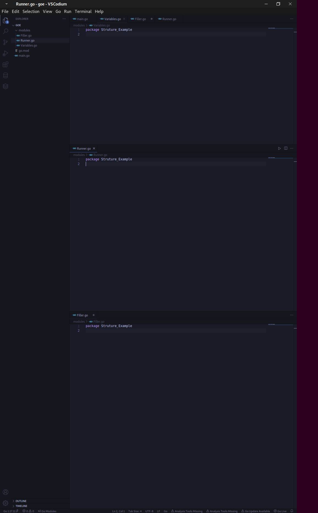

```

                                               
 _____         _____                 _       _ 
|   __|___ ___|   __|_ _ ___ ___ ___| |___ _| |
|  |  | . |___|   __| | |- _|- _|- _| | -_| . |
|_____|___|   |__|  |___|___|___|___|_|___|___|
                                               
Tutorial on the Go programming language and applying that to the cyber and hacker world
```

# Intro 


This tutorial mainly will introduce you to the go programming language, I will be talking about how to use Go to you're advantage in this field, using it to build things like OSINT tools, Vulnerability scanners, fuzzers, engines, brute forcing utilities and much much more. Like most of my tutorials ( Perl for cyber weapons development, Fortran notes, and others alike ) this tutorial will be updated every week or ever few days. Please note that i will not be going over the basics of the go programming language, this follows for all of the following topics - `functions, print statements, some standard packages, fmt, types, data structures, maps, variable lists, import lists, constant lists, calling functions, variables, etc` if you need information about a certian thing or need more guidence of the go programming language i highly suggest you look at this web source 

<https://zetcode.com/all/#go>


## Whoami ##

For those who do not know and are new to my github, instagram page, or discord, allow me to introduce myself. I am a hacker by night and developer by day, I program in multiple programming languages consisting of types like Legacy languages, Modern day languages, Compiled programming languages, Interpretted programming languages, Data typing languages and others. My main field of knowledge stays in Ruby, Go, Perl, C++, Perl6(RAKU), R, Crystal and Fortran77-95.
I am currently learning my way back into hacking slamming into Car hacking and binary exploitation. With a past of making game cheats and getting a job at a totally legal company named L3thal_Poison in the field Dev op sec i strive to help people understand how code works, and how it should be respected and how even the smallest vulnerability in a code can lead to catastrophic results, this even yes goes for the hackers side as well. When developing malware you want to make sure your programs are secure, and when developing IDS's/IPS's you want to make sure the code is fast and robust, thus i am here to teach that. 

Enough about me and what this is, lets dive in 

# About this tutorial, its contents, and other things you should READ

For this article i will be using the codium IDE for writing code, I highly suggest when you hop into the IDE that you install the extension for go, or gopls, this allows you to autoformat code, auto indent code, and auto import libraries ( standard only, unless pre defined in the go mod file), i did not discuss what libraries will be imported, but you will still see them being imported. Unless they are packages like BUF_IO or other packages that can have an advanced side i do not discuss anything about them other than what they are. If you are new to golang this tutorial is not suggested, this tutorial mainly discusses using the hacking field to not only advcance your skills in the programming world ( with Go ) but also give you a good understanding of the hacking field with a broader aspect, i know that came out weird sorry.

anyway, unless you know a decent amount of go this includes 

```
functions, simple programs, for loops, arrays, slices, output, input, and things like file handle's 
```

then i highly suggest you visit and read <https://www.zetcode.com/all/#go> zetcode has been an AMAZING resource for me when i started out go, it took me months to find it when i was missing out on information about Go, i highly advise to you that you read all of the following sections 

```
Go intro 
Go basics 
Go build
Go variable 
Go function
Go append function 
Go make function 
Go print functions
Go predicate 
Go Closure
Go ellipses 
Go operators 
```

There are way more sections to read through on this simple pdf/tutorial site, so please read through it to make sure you understand the language enough to go through this tutorial. Also note that i will be using advanced code samples further in, however i will be explaining how the code works in every way possible.


# Why use go for cyber weapons 

The go programming language is a very very robust, fast, lightweight language that gives you the speed of a low level language with the features of a high level programming language. Outside of the C language and C++ language ( Tutorial coming on that soon ), Go is one of the better programming languages for hacking with the amount of features and its robust code. I am not going to be your everyday author, or writer, im not going to glorify a programming language, sure i will say its good for a certian topic and back it up but i also want you to realize the issues with each language i talk about, moving on what are the cons of the Go programming language? Go is a great language, fast, again light and robust however its current syntax (as of writing, go is at `version 1.18`, if you are reading this when a newer version has come out, this information may or may not apply) is a bit wack, for begginers as i have come across many times the go programming syntax can be super weird to get used to, especially if you come from a language like python where everything is practically easy and fast to do.

However the language makes up for it later, another common issue people have with the language is that it is SUPER annoying to run system commands in. Some people see this as a bad thing and it might turn you away from the language which yes it can however this also means it is harder to create vulnerabilities. Running system commands can and cant be good, like getting user input, if you use `scanf` in C this can be problematic, but when it is done the right way and correctly made it can actually be quite fast and less vulnerable to use especailly when you sanitize the input. Anyway this follows the same concept, i highly suggest you do not try to run system commands with go unless you do know the ins and outs of the language, understand channels, threaded functions, types and other things to make it not so vulnerable or just make it not slow.

Moving on, the next section will talk about running functions with types, channels and more. again for more context please read on the go language at 

<https://zetcode.com/all/#go>


no this is not a promotion they just helped me alot in the area


# Writing good code

in todays world there is not much programmers who prefer writing advanced code because to them it is not worth it, they do not want to go through the work of writing good, secure, and robust code. Therefore in this section i will be talking about making use of golangs types, funcs, maps, and certian statments that might actually make you're code worthwhile downloading and using. Side note, i know it sounds weird `programmers do not want to do the work` but its true, i rarely come across people with skill in this field that have a passion, usually its just people here to make a living and get it for the money which as we see in everyday jobs like certian government jobs putting money first can endanger someones life, likewise in this field you are putting systems at risk if you do not write secure, well written, robust code. For the sake of this tutorial i will not be going over to advanced concepts like the following keywords `go, go func, chan` however i will use data types and conversions like implimenting json into data structures, functions into maps, and using data types like Interface to write decent code.


##### Using Types and data structures ####

Whenever you make engines, ajax spiders, sometimes even tools to fetch data from a API you may want to use types to format data and output it properly, unmarshal JSON, YAML, XML, or other various data typing languages, storing data across modules to access it for later, or simply just load functions with types it is ideal to use them. 

> Why use a type structure over something like a list of variables 

Variables are good to use, however type structures are way more consistent to use, more versatile, and allow you to mix data format like JSON and XML, which means if you needed to you can parse a response body in JSON and use the structure to access the data held inside of the variables.

Using types have the following syntax 


```

type Structure_name struct {
      Variable Data_type
}
```

say we wanted to init a type named Users and we wanted to have three values, one is a string, and the other two are integers, we would do the following 


```go
type Users struct {
      Username string 
      Age int 
      Needed_age int
}
```

`Users` is the data structures name <br>

`Username` is the username which must be a string, any other value that is a different type we try to assign it will not be accepted.<br>

`Age` is the users age which will accept a value of type integer 

`Needed_age` is the same as age, it will only accept a value that is of type integer 

<br>

it is pretty simple right? This should be a 123 to understand, types as you move on more and more in go will get more complex such as assigning new structures under a already pre defined structure, or mashing types and data formats togther. Throughout this tutorial we will be using type structures more and more so gte used to them.


> Accessing the type structure 


Accessing and using data types can be a bit wacky, sometimes you may even find yourself using for loops, range statements, maps to access variables which is what we will talk about here.

In order to print data or output data from a structure we need to first add values to the structure but first initiate the structure.


```go
package main 

type Users struct {
    Username string
    Age int
    Needed_age int
}

var Username_init Users


func main() {
    Username_init.Username = "jake1234"
    Username_init.Age      = 19
    Username_init.Needed_age = 18
}
```

this code is quite simple, it first starts by delaring the type as discussed before, then it declares a global variable with the `var` keyword, this variable named `Username_init` is the initiation for the data structure, or the variable we will use to reach the values inside of the data structure. When accessing variables inside of a structure we must use the variable keyword `Username_init` followed by a `.` which will tell the program that we want to access a variable in the structure, then simply access the variable name inside of the structure then assign it a value, after the `.` the variable that you want to reach ( as long as it is reachable ) can be called, you can now use `Username_init.Username` to really anything, as an argument, to output data, or in this case to assign a value to that structurs variable. 

Pretty simple right? 

this is where it can get tricky, outputting data in a normal structure like this can be quite simple however in the next example like the more tedious structure it can pend, this leads us into our next section which is introducing more complexity in structures.

> introducing slices under structures 

The further you go on in the hacking relm, and writing hacking tools or even simple recon tools in go you will realize the more you will find yourself needing to use something like a chained structure ( in a sense a chained structure is where two structures are linked together by one variable in that structure ), using slices, or even using for loops and what not to access variables. The following example will introduce you to two structures, one which chains the second structure together. 

```go
package main

import "fmt"

type Address struct {
	City    string
	Country string
}

type User struct {
	Username string
	UserAge  int
	Addr     Address
}

var dt User

func Parse_Vals() *User {
	data := User{
		Username: "John3939390",
		UserAge:  19,
		Addr: Address{
			City:    "Some city name",
			Country: "USA",
		},
	}
	return &data
}

func main() {
	Structure := Parse_Vals()
	fmt.Println("Username  -> ", Structure.Username)
	fmt.Println("User age  -> ", Structure.UserAge)
	fmt.Println("User City -> ", Structure.Addr.City)
	fmt.Println("User Country -> ", Structure.Addr.Country)
}
```


there is alot to go over here but im going to make it short but also explain well 

We introduce two new structures 

`User` and `Address`

The first structure `User` has three fields, username and user age, username and user age are standard variables to that structure which means simply by defining a variable for that type like 

```go						
var v User
```

we can resch and print the values like 

```go
fmt.Println(v.Username)
```

however why is `Addr Address` there? Addr is like defining a variable using the var keyword to define a structure and pull data from that structure however the difference here is it is used differently and implimented inside of another structure, if thats true how would we add values to it? simple we create the following function  

```go
func Parse_Vals() *User {
	data := User{
		Username: "John3939390",
		UserAge:  19,
		Addr: Address{
			City:    "Some city name",
			Country: "USA",
		},
	}
	return &data
}
```

`Parse_Vals()` is a function that returns a data structure, the same structure that is named `User` now in order to return this value we need to use what is known as a prompted field, a prompted field is a variable that prompts the data structure and fills it with data, or appens, or like in this case is used to return the data structure. The variable `data` is used simply to prompt the structure `User` which is then filled out with information, but a cool thing about this is that we can now use the variable data inside of the structure User to reach and fill out values in the field `Addr` which reaches to the structure named `Address`, so we use 

```go
Addr: Address{
  
}
```

to now like above with Users, fill out data in that field. We then run the function in the `main` brick by assigning a variable to it called `Structure`
structure is the variable we will use to reach all variables across both data structures since the function `Parse_Vals()` returns that data for us 

```go

func main() {
	Structure := Parse_Vals()
	fmt.Println("Username  -> ", Structure.Username)
	fmt.Println("User age  -> ", Structure.UserAge)
	fmt.Println("User City -> ", Structure.Addr.City)
	fmt.Println("User Country -> ", Structure.Addr.Country)
}
```

`Structure.Username` will output the username same with the age but what do you notice different here?

in the third print statement we have 

`Structure.Addr.City`

think again of `Addr` as another variable to access a data structure, i myself call this data structure and variable inception, simply use one variable to reach a data structure and under that data structure is a variable to access another data structure which can go on and on and on forever. 

`Structure.Addr.City` is what we will use to output the city of the user, same with country but instead of a city we output the country of the user.

now what else can we do with data structures?

Data structures in the go programming language can do alot, like -> be returned from functions, be spanned across maps and variables, be used in modules and other files, be used to parse XML, JSON, YAML, MSGPACK, and other data typing formats that you may need to parse, and even be used to parse packet and network data. In this next section i will sum up and finish data structures by introducing you to using functions with modules, use whats called a structure tag, and use functions across other files.

Before i get into this im going to say i highly **encourage** you use Capital letters in your structure names, not like `USER_DATA_STRUCT` but like `User_data_struct` and in the data types variables like `User` or `Age` or even when declaring another variable to reach another data structure `Struct_2 Structure2`, Why do i say this? i mention this because in the next few pages you will see us using modules to do even simple tasks like store variables, data types, functions, and variables. We do this because when using modules in Go any function, variable, structure, interface, map, array, or anything that does **NOT start with a CAPITAL LETTER WILL NOT BE EXPORTED BY GO, MEANING YOU CAN NOT CALL THE FUNCTION FROM ONE GO FILE UNLESS THAT FILE IS LOCAL**. This leads us into our next confusing section `Modules and Structures`


GO handels modules really oddly, but you get used to it. Let me first explain the basics, Go is not like any other language where you can import something like python, perl, c, c++, or other languages an example is 

> python

```python
import file from module_name
```

> perl

```perl
use Filename.pm; # pm = perl module file
```

> C++

```c++
#include "header.h"
```

Go actually makes you respect the language in multiple ways. We already discussed how go makes you define `package main` if there are no other files, or folders that are being used if it is not declared as main then it will not run the code or run the function `main`

which means if you try to run the following 

```go
package data 

func main() {
	fmt.Println("go")
}

```

 you will get the error
 
 `package main is not a main package`

in order to do this you must create whats called a `go.mod` file, if you do not know go.mod files are exactly what they are, they are module decleration files that go uses to define a package or library or module whatever you want to call it as what it is.

**contents of a typical go.mod file**

```
module module_name

go 1.17
```

the syntax is `module` which has an argument of whatever the module name is for example if you run `go mod init main` the file will say `module main` and `go 1.17` which defines the go language version. Go.mod is also what you will use to write modules and import filepaths. Alot of tutorials i have seen do not properly show you how to setup modules which is why i am going through this, so you get a deeper understanding of how the go programming language works. lets create a module that outputs and fills out the data of a structure 

first create a file named `modules`

im on linux so inside of a directory im going to use `mkdir modules`

then open that directory again since im on linux im going to touch the following files `touch Variables.go Filler.go Runner.go `

once done open all three files and name them all at the top like this `package Struture_Example`

the package name is up to you but for this example we will be using that. 


here is a screenshot 




now in `Variables.go` define the following structure 


```go
package Structure_Example

type Info struct {
	City string 
	Country string
}

type Data struct {
	Username string
	User_Data Info
}
```

then in `Filler.go` put the following function in it

```go
func (p *Data) Fill_Structures() {
	p.Username = "jake"
	p.User_Data.City = "somecity"
	p.User_Data.Country = "US"
}
```

finally fill in the following in `Runner.go`


```go
package Struture_Example

var International_Country_Code_To_Currency = map[string]string{
	"BD": "BDT",
	"BE": "EUR",
	"BF": "XOF",
	"BG": "BGN",
	"BA": "BAM",
	"BB": "BBD",
	"WF": "XPF",
	"BL": "EUR",
	"BM": "BMD",
	"BN": "BND",
	"BO": "BOB",
	"BH": "BHD",
	"BI": "BIF",
	"BJ": "XOF",
	"BT": "BTN",
	"JM": "JMD",
	"BV": "NOK",
	"BW": "BWP",
	"WS": "WST",
	"BQ": "USD",
	"BR": "BRL",
	"BS": "BSD",
	"JE": "GBP",
	"BY": "BYR",
	"BZ": "BZD",
	"RU": "RUB",
	"RW": "RWF",
	"RS": "RSD",
	"TL": "USD",
	"RE": "EUR",
	"TM": "TMT",
	"TJ": "TJS",
	"RO": "RON",
	"TK": "NZD",
	"GW": "XOF",
	"GU": "USD",
	"GT": "GTQ",
	"GS": "GBP",
	"GR": "EUR",
	"GQ": "XAF",
	"GP": "EUR",
	"JP": "JPY",
	"GY": "GYD",
	"GG": "GBP",
	"GF": "EUR",
	"GE": "GEL",
	"GD": "XCD",
	"GB": "GBP",
	"GA": "XAF",
	"SV": "USD",
	"GN": "GNF",
	"GM": "GMD",
	"GL": "DKK",
	"GI": "GIP",
	"GH": "GHS",
	"OM": "OMR",
	"TN": "TND",
	"JO": "JOD",
	"HR": "HRK",
	"HT": "HTG",
	"HU": "HUF",
	"HK": "HKD",
	"HN": "HNL",
	"HM": "AUD",
	"VE": "VEF",
	"PR": "USD",
	"PS": "ILS",
	"PW": "USD",
	"PT": "EUR",
	"SJ": "NOK",
	"PY": "PYG",
	"IQ": "IQD",
	"PA": "PAB",
	"PF": "XPF",
	"PG": "PGK",
	"PE": "PEN",
	"PK": "PKR",
	"PH": "PHP",
	"PN": "NZD",
	"PL": "PLN",
	"PM": "EUR",
	"ZM": "ZMK",
	"EH": "MAD",
	"EE": "EUR",
	"EG": "EGP",
	"ZA": "ZAR",
	"EC": "USD",
	"IT": "EUR",
	"VN": "VND",
	"SB": "SBD",
	"ET": "ETB",
	"SO": "SOS",
	"ZW": "ZWL",
	"SA": "SAR",
	"ES": "EUR",
	"ER": "ERN",
	"ME": "EUR",
	"MD": "MDL",
	"MG": "MGA",
	"MF": "EUR",
	"MA": "MAD",
	"MC": "EUR",
	"UZ": "UZS",
	"MM": "MMK",
	"ML": "XOF",
	"MO": "MOP",
	"MN": "MNT",
	"MH": "USD",
	"MK": "MKD",
	"MU": "MUR",
	"MT": "EUR",
	"MW": "MWK",
	"MV": "MVR",
	"MQ": "EUR",
	"MP": "USD",
	"MS": "XCD",
	"MR": "MRO",
	"IM": "GBP",
	"UG": "UGX",
	"TZ": "TZS",
	"MY": "MYR",
	"MX": "MXN",
	"IL": "ILS",
	"FR": "EUR",
	"IO": "USD",
	"SH": "SHP",
	"FI": "EUR",
	"FJ": "FJD",
	"FK": "FKP",
	"FM": "USD",
	"FO": "DKK",
	"NI": "NIO",
	"NL": "EUR",
	"NO": "NOK",
	"NA": "NAD",
	"VU": "VUV",
	"NC": "XPF",
	"NE": "XOF",
	"NF": "AUD",
	"NG": "NGN",
	"NZ": "NZD",
	"NP": "NPR",
	"NR": "AUD",
	"NU": "NZD",
	"CK": "NZD",
	"XK": "EUR",
	"CI": "XOF",
	"CH": "CHF",
	"CO": "COP",
	"CN": "CNY",
	"CM": "XAF",
	"CL": "CLP",
	"CC": "AUD",
	"CA": "CAD",
	"CG": "XAF",
	"CF": "XAF",
	"CD": "CDF",
	"CZ": "CZK",
	"CY": "EUR",
	"CX": "AUD",
	"CR": "CRC",
	"CW": "ANG",
	"CV": "CVE",
	"CU": "CUP",
	"SZ": "SZL",
	"SY": "SYP",
	"SX": "ANG",
	"KG": "KGS",
	"KE": "KES",
	"SS": "SSP",
	"SR": "SRD",
	"KI": "AUD",
	"KH": "KHR",
	"KN": "XCD",
	"KM": "KMF",
	"ST": "STD",
	"SK": "EUR",
	"KR": "KRW",
	"SI": "EUR",
	"KP": "KPW",
	"KW": "KWD",
	"SN": "XOF",
	"SM": "EUR",
	"SL": "SLL",
	"SC": "SCR",
	"KZ": "KZT",
	"KY": "KYD",
	"SG": "SGD",
	"SE": "SEK",
	"SD": "SDG",
	"DO": "DOP",
	"DM": "XCD",
	"DJ": "DJF",
	"DK": "DKK",
	"VG": "USD",
	"DE": "EUR",
	"YE": "YER",
	"DZ": "DZD",
	"US": "USD",
	"UY": "UYU",
	"YT": "EUR",
	"UM": "USD",
	"LB": "LBP",
	"LC": "XCD",
	"LA": "LAK",
	"TV": "AUD",
	"TW": "TWD",
	"TT": "TTD",
	"TR": "TRY",
	"LK": "LKR",
	"LI": "CHF",
	"LV": "EUR",
	"TO": "TOP",
	"LT": "LTL",
	"LU": "EUR",
	"LR": "LRD",
	"LS": "LSL",
	"TH": "THB",
	"TF": "EUR",
	"TG": "XOF",
	"TD": "XAF",
	"TC": "USD",
	"LY": "LYD",
	"VA": "EUR",
	"VC": "XCD",
	"AE": "AED",
	"AD": "EUR",
	"AG": "XCD",
	"AF": "AFN",
	"AI": "XCD",
	"VI": "USD",
	"IS": "ISK",
	"IR": "IRR",
	"AM": "AMD",
	"AL": "ALL",
	"AO": "AOA",
	"AQ": "",
	"AS": "USD",
	"AR": "ARS",
	"AU": "AUD",
	"AT": "EUR",
	"AW": "AWG",
	"IN": "INR",
	"AX": "EUR",
	"AZ": "AZN",
	"IE": "EUR",
	"ID": "IDR",
	"UA": "UAH",
	"QA": "QAR",
	"MZ": "MZN",
}

func (p *Data) Get_Currency() string {
	Currency_Watcher := International_Country_Code_To_Currency[p.User_Data.Country]
	return Currency_Watcher
}

```

woah woah woah wtf? where did that come from, is probobly what you are thinking, this is simply to explain to let me :)

The long list named International_Country_Code_To_Currency is a MAP, a MAP in go is a very versatile version of a data structure. Basically in a begginers sense a map allows you to take multiple data types and match them together, the syntax of a map is as follows

```go
map[Argument_data_type]Return_data_type
```

say we wanted to match names and ages right, but did not want to use a bunch of if else then statements, we make a map 

```go
var Ages = map[string]int {
	"jake":1
	"mark":19
	"jan":32
}
```

maps are used to compare and find things, most of the time if not all the time. So here instead of using an if statement we use a map to determin what user or what name is what age. Any data type that is inside of `[]` for example `[string]` will be the type of the argument you use to match to ages, and the value outside of `[]` example `[...]int` will be the value that is returned to you by the map. lets write a function before we contiue to understand how maps work 

```go
package main 

var Ages = map[string]int {
	"jake":1
	"mark":19
	"jan":32
}


func main() {
	name := "mark"
	fmt.Printf("%s is %v years old", name, Ages[name])
}
```

the use of `Ages[name]` will return the number `19` this is because according to the map, the age of mark is 19 so the value returned by the map `IF MARK IS A VALID VALUE IN THE MAP` will return 19, then we format it so it says `mark is 19 years old`

simple right? great lets move on 


in this map here 

```go
var International_Country_Code_To_Currency = map[string]string{
	"BD": "BDT",
	"BE": "EUR",
	"BF": "XOF",
	"RU": "RUB",
	"RW": "RWF",
	"RS": "RSD",
	"TL": "USD",
	"RE": "EUR",
	"TM": "TMT",
	"TJ": "TJS",
	"RO": "RON",
	"TK": "NZD",
	// SNIP
}
```

we need a string as an argument to match in the map, and we will recieve a string if the value exists in the map, so we writwe the following function 

```go
func (p *Data) Get_Currency() string {
	Currency_Watcher := International_Country_Code_To_Currency[p.User_Data.Country]
	return Currency_Watcher
}
```

this function like all other functions in this start off with a structure tag, if you do not know what a structure tag is in go a structure tag is when you use a value to relate, fill, add, subtract, take away, or print out values of a variable. it is quite literally the same thing as `var p Data` howevere the difference is this can only be used with every file of the same package name, if the file does not have the same package name as example ours `package Struture_Example` go will say that type structure does not exist, and we can not call it. To solve this you must go to a main file or whatever other module file you plan to import and in that `.go` file you must variable the data structure from an import, so say we do something like this 

```go
import Data_structure "gomod_module_name/modules"

var Structure Data_structure.Data

func Caller() {
	Structure.Fill_Structures()
}
```

now that you defined `structure` as apart of `Data_structure.Data{}` you can now call any function or variables THAT STARTS WITH A CAPITAL LETTER from that file which imports that data structure.


it seems a bit complicated but trust me you WILL get used to it, moving onto what we do with this function. 

the function `Get_Currency` will take the value from the variable `p.User_Data.Country` and match it up to the map, first we need to designate the maps output to a variable so we use `Currency_Watcher` to do that, with the final call being

```go
	Currency_Watcher := International_Country_Code_To_Currency[p.User_Data.Country]
```

now when we parse the data the variable `Currency_Watcher` should have the value `USD`, lets hop into our main.go file OUTSIDE OF THE MODULES DIRECTORY and put the following code in it 

before hand i created a go.mod file named main with `go mod init main` so main is how i will import packages

```go
package main

import (
	"fmt"
	Data_structures "main/modules"
)

type Currency struct {
	Currency_by_code string
}

var s Data_structures.Data
var dt Currency

func main() {
	s.Fill_Structures()
	dt.Currency_by_code = s.Get_Currency()
	fmt.Printf("user [ %s 's] countries currency is %v \n", s.Username, dt.Currency_by_code)
}
```

when we run the program by `go run main.go` we get the output `user [ jake 's] countries currency is USD`

this pretty much ends it as far as maps and structures can get on a decent level, lets now move onto 

> sum it up


That pretty much for now sums it up for data structures, they can be much more advanced than this and we soon may even come across data types like the following which is a autogenerated data structure used to parse a single XML file from the NMAP project


```go
type Auto_Gen_Nmaprun struct {
	XMLName          xml.Name `xml:"nmaprun"`
	Text             string   `xml:",chardata"`
	Scanner          string   `xml:"scanner,attr"`
	Args             string   `xml:"args,attr"`
	Start            string   `xml:"start,attr"`
	Startstr         string   `xml:"startstr,attr"`
	Version          string   `xml:"version,attr"`
	Xmloutputversion string   `xml:"xmloutputversion,attr"`
	Scaninfo         struct {
		Text        string `xml:",chardata"`
		Type        string `xml:"type,attr"`
		Protocol    string `xml:"protocol,attr"`
		Numservices string `xml:"numservices,attr"`
		Services    string `xml:"services,attr"`
	} `xml:"scaninfo"`
	Verbose struct {
		Text  string `xml:",chardata"`
		Level string `xml:"level,attr"`
	} `xml:"verbose"`
	Debugging struct {
		Text  string `xml:",chardata"`
		Level string `xml:"level,attr"`
	} `xml:"debugging"`
	Hosthint struct {
		Text   string `xml:",chardata"`
		Status struct {
			Text      string `xml:",chardata"`
			State     string `xml:"state,attr"`
			Reason    string `xml:"reason,attr"`
			ReasonTtl string `xml:"reason_ttl,attr"`
		} `xml:"status"`
		Address struct {
			Text     string `xml:",chardata"`
			Addr     string `xml:"addr,attr"`
			Addrtype string `xml:"addrtype,attr"`
		} `xml:"address"`
		Hostnames struct {
			Text     string `xml:",chardata"`
			Hostname struct {
				Text string `xml:",chardata"`
				Name string `xml:"name,attr"`
				Type string `xml:"type,attr"`
			} `xml:"hostname"`
		} `xml:"hostnames"`
	} `xml:"hosthint"`
	Host struct {
		Text      string `xml:",chardata"`
		Starttime string `xml:"starttime,attr"`
		Endtime   string `xml:"endtime,attr"`
		Status    struct {
			Text      string `xml:",chardata"`
			State     string `xml:"state,attr"`
			Reason    string `xml:"reason,attr"`
			ReasonTtl string `xml:"reason_ttl,attr"`
		} `xml:"status"`
		Address struct {
			Text     string `xml:",chardata"`
			Addr     string `xml:"addr,attr"`
			Addrtype string `xml:"addrtype,attr"`
		} `xml:"address"`
		Hostnames struct {
			Text     string `xml:",chardata"`
			Hostname []struct {
				Text string `xml:",chardata"`
				Name string `xml:"name,attr"`
				Type string `xml:"type,attr"`
			} `xml:"hostname"`
		} `xml:"hostnames"`
		Ports struct {
			Text       string `xml:",chardata"`
			Extraports struct {
				Text         string `xml:",chardata"`
				State        string `xml:"state,attr"`
				Count        string `xml:"count,attr"`
				Extrareasons struct {
					Text   string `xml:",chardata"`
					Reason string `xml:"reason,attr"`
					Count  string `xml:"count,attr"`
					Proto  string `xml:"proto,attr"`
					Ports  string `xml:"ports,attr"`
				} `xml:"extrareasons"`
			} `xml:"extraports"`
			Port []struct {
				Text     string `xml:",chardata"`
<-- snip
}
```

As far as modules go, modules are quite simple to understand in go despite the learning curve, i like to use modules alot as they come in handy when writing large code files or large projects like the red rabbit project as i wrote, if i stuffed 90,000+ lines of code including everything in the red rabbit project it would NOT be concurrent at all, it would be extremely slow, unprofessional, and even may have led to large amounts of bugs with conflicting types, maybe even a security vulnerability.

In order to make handy, large, and usable scripts you usually especially in hacking may use something like a mock of a shell, or a large amount of arguments to run certian functions in the script, so this will move us onto the next advanced section in `Writing secure code`

> Using Maps, Functions, and other things alike to achieve running functions and making trustable code

I am going to start this off by saying 99.9% of the code you come across in languages like C coming from begginers is unsafe, especially when they are developing heafty programs and do not know of any common vulnerable functions, or how to dump memory, save memory, or properlly store values which can cause programs to be vulnerable to things like BOF making it easy for someone to exploit the binary. A good thing about go is typically even in some advanced robust situations you do not need to worry about managing memory, despite it having low level features go remains to take away aspects that can make code very vulnerable ( not all the time though ) so this next section will be talking about writing advanced code, and running user input the safe way, and as well as ways i never got to find without experience ( SHHHHHH its a secret ).


Alot of people ask the question ( why use Maps or Switch statements instead of if then or if else statements ) 

I will always say this, if statements are not bad, however in large amounts they can be quite CPU intensive which for a program is never good, sure if statements like 1 - 5 max are good but using something like 1 - 90 in one file just makes the program over slow, makes it unecessary to run on your system, takes up much if not ALOT of your system resources, can be more and more buggy, and can run into issues. Using MAPS and Switch statements will always be a better alternative, especially in the go programming language. A nice thing about go is go comes with a standard package called `bufio` or `BUFF` `IO` it allows the user to so much more better options for things like scanning text, user based input, file input and output, mainly I/O handleing, another thing about go is if we truly wanted to we can also use the data type `interface{}` with a map like the following code 

```go
var Data_map = map[string]interface{}
```

a interface basically allows you to add multiple types, kinda like in the programming language fortran when you declare a variable ( do not worry about that you do not need to remember it however if you want to view the fortran tutorial go here [https://www.github.com/ArkAngeL43/fortran-notes])

this means this map can have multiple types, it can be a integer, data stucture, string, uint ...etc again really any data type. What does this have to do with if statements? Like other programming language you can pre define functions and add them into this map, so not only do we have secure Input/Output using BUFIO but we also can add a way more robust and fast way to execute functions based on a map. So how would this be designed?

simple 

* Take input from a USER using the `bufio` go standard package
* Trim the user input telling it to ingore any input that starts a new line `when the user presses enter`
* Create a map that will match up a command like "hello" or in other senses "set" then run a function if that command is found in the map \
* Load back to the interactive console when the input and function have been parsed and run correctly with no error

We will have 2 files 

in a directory called `modules` create two files 

**Commands.go**

**Console.go**

outside of the modules directory create a file named `main.go` and run the command `go mod init main`

let us hop into the directory `modules` and start editing the Comamnds.go file, this file will be responsible for data types, maps, and the function we will run as well as the access variable for the data structure, the following code is what should be inside of the Commands.go file 

```go
package Console_main

import "fmt"

type Message struct {
	Name string
}

var Access Message

var Func_Map = map[string]interface{}{
	"hello": Access.Hello_there,
}

func (QT *Message) Hello_there(filler string) {
	fmt.Printf("\n:> Hello there user! i see you set your name as %s\n\n", QT.Name)
}
```


First we declare our package name as `Console_main`, import fmt (go format package) for formatting, then declare a data structure which is named `Message`. Message is responsible for storing the variable / name we will output when running the function. then we declare `Access` which is the variable reacher as i like to call it to initate the Message data structure, we then define our map


```go

var Func_Map = map[string]interface{}{
	"hello": Access.Hello_there,
}
```

this map is named `Func_Map` and accepts a string as the command and returns a interface, the interface is what our functions will be, in this case we will be calling the Access variable with the Hello_there function, the function hello there accepts a filler as an argument `this is just for map parsing and the mean time`, it then describes the variable `(QT)` as the secondary variable to the `*Message` data structure. Note again functions that use `()` before the function name usually must be used as a type structure, meaning they can ONLY be called WITH A VARIABLE THAT REPRESENTS THAT DATA STRUCTURE, IN THIS INSTANCE WE USE `Access.Hello_there` TO CALL THE FUNCTION.

Normally functions are called like `function()` but in this case we will not be adding the `()` instead just leaving it as is, this is because the parser we are about to write executes and runs the function with its required arguments without us needing to use `()` even if we wanted to go will manage to throw an error like the following 

```go
var Func_Map = map[string]interface{}{
	"hello": Access.Hello_there(),
}

/*
 ERROR -> 

modules/Commands.go:12:29: not enough arguments in call to Access.Hello_there
        have ()
        want (string)

*/
```

we would need to include the arguments which currently we do not have set, rather a parser will run that function to call that data and parse those values that is wanted by the function, so to do this hop into `Console.go`
 
 
this is where things will start getting tricky, this file not only handels maps, but uses keywords like `chan, func` and symbols like `->` `<-` and `-`,

the first step of our code will be to redeclare the package name 


```go
package Console_main 
```

then we will impliment something called `Handle Return CON` this is a function i often repeat in some of my code across the span of projects, it is a simple handler to handle CTRL+C or Operating System Terminate / KILL calls, so the user does not have to type `exit` in the console to exit.

```go
func Handle(ch chan os.Signal) {
	signal.Notify(ch, os.Interrupt)
	for k := <-ch; ; k = <-ch {
	   switch s {
	   	case os.Interrupt:
			fmt.Println("[+] Killing process and exiting")
			os.Exit(0)
		case os.Kill:
			fmt.Println("[*] Recived a signal to kill the program, exiting")
			os.Exit(0)
	   }
	}
}
```

i know i know, this is a huge step up so let me explain 

we first use the keyword `chan` if you do not know what chan means, chan in go stands for channel, and channel's in go represent something called a `goroutine` well channels do not represent it but rather work along side of a goroutine, goroutines are lightweight standard threads go has, if you ever needed to pass data to a threaded function you would use something like `go` which uses the chan keyword, `ch` is defined as `chan os.Interrupt` in this, the handle will take the aruments given to the function, and pass the data of k to the channel `ch` using `<-` Arrows in go used along side of channels and threads are typically used to send or output data from channels, an example is when we define 

```go
for k := <-ch; ; k = <-ch {}
```

this is making K the new variable that holds the data sent to the channel when running the function, so in order to run or call this function we use 

```go
go Handle(make(chan os.Signal, 1))
```

if you dont know 

the make built-in function allocates and initializes an object of type slice, map, or chan (only). Like new, the first argument is a type, not a value. Unlike new, make's return type is the same as the type of its argument, not a pointer to it. The specification of the result depends on the type.

i stepped a bit far on that one but you will see where we call this function soon, moving onto the MAP and COMMAND parser we create a function called `Parser_With_Args` which looks like the following 

```go
func Parser_With_Args(Module string, Map_of_choice map[string]interface{}, Module_Arg string) interface{} {
	Module = strings.TrimSpace(Module)
	dt := Map_of_choice[Module]
	if dt == nil {
	} else {
		dt.(func(string))(Module_Arg)
	}
	return dt
}
```

this function requires 3 arguments and returns 1, the first argument `Module` is used to define the command, the module we will be accessing is `hello` so that will be the first argument, then we see `Map_of_choice map[string]interface{}` this argument requires a MAP, which we predefined in `Commands.go` the map we want to choose will be `Func_Map`, please note that we can not use any other map that is not alike, the Map_of_choice argument needs a map that accepts a argument of type string and outputs a interface{} if the map is `map[string]string` it will not be accepted into the function, due to obvious reasons, the type isnt supported.

We have the final argument named `Module_Arg` this will be the argument we use to output the function, simply after we enter the command `hello` we add a value after that with whatever as long as there are no spaces, so if we enter `hello jake` the output will be `:> Hello there user! i see you set your name as jake`

now moving on, We redefine the variable `Module` which we trim any and all spaces from that string, just to prevent errors in the module. Then we define `dt` which will be the runner, this variable is responsible for taking the map of choice, and matching it up to our command, so look at this example below 

when we enter all our function arguments properly of the function `parser_With_Args` instead of it being 

```go
dt := Map_of_choice[Module]
```

it will look something like this ( note in the code ) 

```go
dt := Func_Map["Hello"]
```

exactly as discussed when parsing the currency of the users country a little bit above. Now we move onto the if statements, if the value of DT is nil meaning the map returned empty and the command was not found in the map then it will not do anything, else it will execute it using `dt.(func(string))(Module_Arg)` this can be a bit confusing, dt is the value of a map that is returned of type interface, it then goes onto use the `func` keyword in go which specifies a function without a name **NOTE THE FUNC KEYWORD CAN ONLY BE USED INSIDE FUNCTION BLOCKS NOT OUTSIDE**, then it calls for an argument of string, that argument will be the argument of the function in the map that is called or in our case `Access.Hello_there`, then outside of the func argument it specifies the argument it will send to the function which in our case would be something like `jake`


i know it seems scary but trust me its not! 

now we move onto the Run function, the RUN function is our console, our command line, the whole building block to executing commands and parsing values

```go
func Run() {
	reader := bufio.NewReader(os.Stdin)
	for {
		fmt.Print("Console  :>> \033[37m")
		t, _ := reader.ReadString('\n')
		t = strings.Replace(t, "\n", "", -1)
		go Handelreturncon(make(chan os.Signal, 1))
		if string(t) != "" {
			fmt.Println("Executing command -> ", string(strings.TrimSpace(t[0:5])))
			switch string(strings.TrimSpace(t[0:5])) {
			case "hello":
				Access.Name = string(strings.TrimSpace(t[6:]))
				Parser_With_Args(string(strings.TrimSpace(t[0:5])), Func_Map, string(strings.TrimSpace(t[6:])))

			}

		}
	}

}
```

first we define the bufio.NewReader function with the variable reader, the reader will read user based input from the `OS STANDARD INPUT / OS STDIN`, we then proceed under a for loop, this will be where the magic is done, first we print a message which is `Console :>> ` this will let the user know that there is a listening command prompt there to accept commands. Then we define T which does a string read by reader `reader.ReadString('\n')` this will tell the reader to accept any values that are spaced, but when the user hits enter or starts a new line in the OS STDIN then it will cut and continue onto the block.

Then we tell the variable of T to replace all of its values of `\n` with a empty value a more defined description of this function is 

```
Replace returns a copy of the string s with the first n non-overlapping instances of old replaced by new. If old is empty, it matches at the beginning of the string and after each UTF-8 sequence, yielding up to k+1 replacements for a k-rune string. If n < 0, there is no limit on the number of replacements.
```

finally we call `go Handle(make(chan os.Signal, 1))` which calls our listener to pass data or to listen back and fourth on a thread to see if the user chooses to exit the program with CTRL+C or if they send a OS.KILL msg to the process. we then detect / test if t is empty, if it is not empty we proceed to output the command 

```
			fmt.Println("Executing command -> ", string(strings.TrimSpace(t[0:5])))
```

lets disect this a bit 

first we make sure we use the built in function to go `string()` to convert `t` to a string or make sure its a string, then use strings.TrimSpace to trim all spaces of T then call `t[0:5]` this tells the program to read t from 0 - 5 the exact length of our command `hello`, the slicing works as so `string[beggining_of_string:end_length_of_string` in our example the string is `t` the `beggining of string` is `0` since thats the index the string starts at, then the `end length of string` is 5 because that is the total length of the command that is SUPPOSED to be predicted. This can be unsafe code since we are trusting that the user input a command of exactly a length of 5, or in this case hello. We should **NEVER TRUST THE USER FOR INPUT, MEANING WE SHOULD NEVER EVER EVER EVERRRRRR ALLOW THE USER TO INPUT WHATEVER THEY WANT, A MORE SECURE OPTION WOULD BE TO CHECK FOR THE LENGTH OF THE VARIABLE AND USE MATHEMATICS TO GET THE COMMANDS LENGTH, THIS IS NOT! AND I MEAN NOT!!!! RECOMENDED**

Before i go on i would like to state, i heavily encourage you as a learner to experiment with this code, find out what causes a error or a segment violation in the code, edit it and even make changes you think would be better, like the following modifcation to the program, instead of cosntantly repeating `string(strings.TrimSpace(t[0:5])))` we could do 


```go
func Run() {
	reader := bufio.NewReader(os.Stdin)
	for {
		fmt.Print("Console  :>> \033[37m")
		t, _ := reader.ReadString('\n')
		t = strings.Replace(t, "\n", "", -1)
		go Handelreturncon(make(chan os.Signal, 1))
		if string(t) != "" {
			new_cmd := string(strings.TrimSpace(t[0:5]))
			fmt.Println("Executing command -> ", new_cmd)
			switch new_cmd {
			case "hello":
				Access.Name = string(strings.TrimSpace(t[6:]))
				Parser_With_Args(new_cmd, Func_Map, string(strings.TrimSpace(t[6:])))

			}

		}
	}

}
```

and store it in a variable called new_cmd, and if you wanted to get fancier use a data structure. anyway lets move on, we then declare a switch statement, if hello is the beggining of the command that we picked up from our shell we will parse the values of the data structure `Message` with anything after the word hello, so say we said `hello jake` the variable of Data structure `Message` named `Name` will now be `jake` note when we do this and we trim the spaces this is still not okay, sure it seems fine and it can be considered safe code however when we use `t[6:]` we are telling the value to assign the variable a value after the length of `5` which means we are still assuming and trusting the user added `hello` which if they are playing around with the program most likely is not going to happen, try it yourself and see what happens if you go overboard and use a character of 100 characters ( i will talk about this later ), anyway after the variable `Access.Name` is set, the parser function will be called with all correct values. 

Our full code reads the following ( in the console file )


```go
package Console_main

import (
	"bufio"
	"fmt"
	"os"
	"os/signal"
	"strings"
)

func Handelreturncon(c chan os.Signal) {
	signal.Notify(c, os.Interrupt)
	for s := <-c; ; s = <-c {
		switch s {
		case os.Interrupt:
			fmt.Println("[-] Detected interruption")
			os.Exit(0)
		case os.Kill:
			fmt.Println("GOT OS KILL")
			os.Exit(0)
		}
	}
}

func Parser_With_Args(Module string, Map_of_choice map[string]interface{}, Module_Arg string) interface{} {
	Module = strings.TrimSpace(Module)
	dt := Map_of_choice[Module]
	if dt == nil {
	} else {
		dt.(func(string))(Module_Arg)
	}
	return dt
}

func Run() {
	reader := bufio.NewReader(os.Stdin)
	for {
		fmt.Print("Console  :>> \033[37m")
		t, _ := reader.ReadString('\n')
		t = strings.Replace(t, "\n", "", -1)
		go Handelreturncon(make(chan os.Signal, 1))
		if string(t) != "" {
			new_cmd := string(strings.TrimSpace(t[0:5]))
			fmt.Println("Executing command -> ", new_cmd)
			switch new_cmd {
			case "hello":
				Access.Name = string(strings.TrimSpace(t[6:]))
				Parser_With_Args(new_cmd, Func_Map, string(strings.TrimSpace(t[6:])))

			}

		}
	}

}
```

now we must import this code and run it, coming from what we learned with the use of modules we can take the following code and write it in our `main.go` file OUTSIDE of the `modules` directory 

```go
package main

import Utils "main/modules"

func main() {
	Utils.Run()
}
```


when we run `go run main.go` or `go run .` and enter `hello jake` we get the following

```
Executing command ->  hello

:> Hello there user! i see you set your name as jake

Console  :>>
```

first it tells us we are executing the command hello, then it runs the function and outputs the message, and returns to the console, to exit we simply just `CTRL+C`

```
Console  :>> ^C[-] Detected interruption
```

and if we wanted to test the handle find the PID of the go file and kill to test if the os.kill switch works 


in order ot get the PID we can simply add this line to the main.go file 

```go
fmt.Println("PID -> ", os.Getpid())
```

and ofc the `os` import under the import list

for me the PID of this go file is `7016` yours may be different, but in this case open another shell and use the command `kill` to kill the PID, when we switch to the other terminal which is hosting the command shell we can see the following 

```
PID ->  7016
Console  :>> signal: terminated

```

inidcating the function `handle` works and is listening on another thread just like CTRL+C 


We have finished the basic section to this tutorial, the very very first section, now it is time to use this knowledge to build net / host scanning tools, which brings us to our new section.


# Using go for cybersecurity programs Section 0x0001

(Warning this will come off as bias, choose to ignore or read at your own risk) For the past few months i have been using Go as a primary language for any form of cyber security, code generation, and to my odd suprise go has been exceptional, it does not seem to be that complicated to build complex applications, robust code, or even things like mock ups of SQL managment solutions. I can personally say from experience in terms of typing, Go is a strongly, statically typed language, it was well writen and designed ( outside of the syntax ), and really lives up to its name `Go` anytime i need to go fast go is there to make that happen in cyber security and most things i choose to write in it, like http servers, web interfaces, or again cyber security tools.

This section will talk about making a console like above to allow the user to create a metasploit based design for a terminal allowing a user to scan for hosts with robust and fast code. Scan for things like hosts, port on a host, and allow a user to set a host within the same session. 

This will seem complex at first but there is a reason we steer away from easy code, thats because 100% of the time the most complex code is the most preformant, speedy, and more stable vs something like a bunch of if statements as discussed above.


So what is the layout to this scanner and what do i mean by `msf like design`?

for those who do not know project MSF is metasploit, and for those who have not used it metasploit is a interactive user based console, metasploit operates on modules for things like detecting commands like set, or scan or use like the following 


** SETTING LHOST IN THE METASPLOIT CONSOLE **

```
                                                  
                                              `:oDFo:`                            
                                           ./ymM0dayMmy/.                          
                                        -+dHJ5aGFyZGVyIQ==+-                    
                                    `:sm⏣~~Destroy.No.Data~~s:`                
                                 -+h2~~Maintain.No.Persistence~~h+-              
                             `:odNo2~~Above.All.Else.Do.No.Harm~~Ndo:`          
                          ./etc/shadow.0days-Data'%20OR%201=1--.No.0MN8'/.      
                       -++SecKCoin++e.AMd`       `.-://///+hbove.913.ElsMNh+-    
                      -~/.ssh/id_rsa.Des-                  `htN01UserWroteMe!-  
                      :dopeAW.No<nano>o                     :is:TЯiKC.sudo-.A:  
                      :we're.all.alike'`                     The.PFYroy.No.D7:  
                      :PLACEDRINKHERE!:                      yxp_cmdshell.Ab0:    
                      :msf>exploit -j.                       :Ns.BOB&ALICEes7:    
                      :---srwxrwx:-.`                        `MS146.52.No.Per:    
                      :<script>.Ac816/                        sENbove3101.404:    
                      :NT_AUTHORITY.Do                        `T:/shSYSTEM-.N:    
                      :09.14.2011.raid                       /STFU|wall.No.Pr:    
                      :hevnsntSurb025N.                      dNVRGOING2GIVUUP:    
                      :#OUTHOUSE-  -s:                       /corykennedyData:    
                      :$nmap -oS                              SSo.6178306Ence:    
                      :Awsm.da:                            /shMTl#beats3o.No.:    
                      :Ring0:                             `dDestRoyREXKC3ta/M:    
                      :23d:                               sSETEC.ASTRONOMYist:    
                       /-                        /yo-    .ence.N:(){ :|: & };:    
                                                 `:Shall.We.Play.A.Game?tron/    
                                                 ```-ooy.if1ghtf0r+ehUser5`    
                                               ..th3.H1V3.U2VjRFNN.jMh+.`          
                                              `MjM~~WE.ARE.se~~MMjMs              
                                               +~KANSAS.CITY's~-`                  
                                                J~HAKCERS~./.`                    
                                                .esc:wq!:`                        
                                                 +++ATH`                            
                                                  `


       =[ metasploit v6.2.3-dev                           ]
+ -- --=[ 2227 exploits - 1172 auxiliary - 398 post       ]
+ -- --=[ 864 payloads - 45 encoders - 11 nops            ]
+ -- --=[ 9 evasion                                       ]

Metasploit tip: Enable verbose logging with set VERBOSE 
true

[msf](Jobs:0 Agents:0) >> set lhost 1.1.1.1
lhost => 1.1.1.1

```

that is something similar to what we want, we want the user to be able to change a host using a simple module named `set` and a value after that like `host` then the hostname after declaring those two variables, so how will we do it? just like we did with hello jake but a little bit more fancier than that.

we next want the user to access a module named `scan` which will allow the following options 

```
ports and hostnames 
```

ports will be designed to scan ports, hostnames will be designed to get the hostname of the given IP, note the host must be an IP, this is something we will be designing this has nothing to do with go itself.

simple scanner right? nothing to hard.

First lets discuss how in a sense a simple port scanner will work, simply all a port scanner does is go under a range or for loop of ports an example in go would be 

```go
for port := 0; port < 65535; port++ {

}
```


under that for loop it will attempt to connect to the host on that port, simply checking if the port works or is not being used, if it is being used it will be open, if not it will be closed. Programs like NMAP and MASSCAN will check for more data, try to probe the device for information, fingerprint and more, we will not be getting into that right now however lets just build out scanner first. So this scanner will work in multiple ways, It will simply allow the user to run a program, specify a host, then specify a command they want to launch and wether thats scanning or whatever we excute it. Now note for this one we will still be assuming and trusting the user. As of writing i myself am currently experimenting with this method and maybe may even add it in here later on when i figure it out. However, you are completely free to brand the software and programs as your own AS LONG AS YOU MODIFY THE CODE, i will not come after you however i highly encourage if you want to re brand or re lable this software you experiment with the code and actually change it for the better.

Lets head to the first step

# Naming the program

We always always want to come up with a unique name for this program especially if we are going to release it, this is a step you can skip its just extras for fun. So this script in summary is a scanning console that allows users to set an address and run commands for it. I think a good name for this script would be peak, peak because the script does not really look into hosts that deep however it gets a peak of information about the host. so lets add a cool banner

**banner.txt**

banner.txt will be where the banner is hidden, later on in the code we will use this file to be outputted as the ASCII banner. Typically i will not add huge banners to my script, if you want to you can choose to add just the banner art `peaked` as a ascii word or figlet version.

```
                                      ░░                            
                                  ░░▓▓░░▒▒░░                        
                                ▒▒░░░░░░░░░░░░▒▒                    
                          ░░▒▒░░░░░░░░░░░░░░  ░░                    
                        ▒▒  ░░░░░░░░░░░░  ░░░░▒▒                    
                    ██░░░░░░░░░░░░░░░░░░░░░░░░▒▒                    
                ██  ░░░░░░░░░░░░  ░░░░░░░░░░░░▒▒                    
            ▒▒░░░░░░░░░░░░░░░░░░░░░░░░░░░░▒▒▒▒▓▓    ▓▓▓▓██          
            ▒▒▒▒░░░░░░░░  ░░░░░░░░░░░░▒▒▒▒▒▒▓▓    ▓▓░░▒▒▓▓▓▓        
              ▒▒▓▓▓▓▒▒░░░░░░░░░░░░▒▒▒▒░░▒▒▒▒░░▒▒  ░░░░░░▒▒▓▓        
                ▓▓████▒▒░░░░░░▓▓░░░░▒▒▓▓▓▓▒▒▒▒▒▒░░░░░░▓▓▒▒▓▓        
                ▓▓██████░░▒▒▒▒░░▓▓▒▒██▓▓▒▒▓▓▓▓▓▓▒▒▒▒      ░░        
                  ▓▓▓▓██▒▒░░░░██    ▓▓▓▓▓▓▓▓██░░                    
                    ██▒▒▒▒██          ▓▓                                                                                   
[v1.0] peaked
```

anyway thats all that goes behind the name so lets move onto our F layout ( File layout )

# Layout 

The layout of this program remains simple, inside of a directory called moudles we will have two directories and three files, the two directories are called modules and XML, why XML? I will not be going over the code that is included in this file, since it is well over a thousand lines of code / data types. Remember how I explained further in this short book or tutorial we may be using advanced Data structures using things like XML? well yup this is the time. If you do not know a while back i wrote a program called red rabbit which is a cyber security framework which mashes a bunch of tools that were made from scratch together. In this framework i have a modules filepath which has another directory called XML in it, in the XML directory i have a file named `types.go` this file holds data structures for parsing a single XML file yes one XML file reuired a few thousand lines to parse, well the reason it is so big is it is parsing a large XML file which belongs to a computer company that has a record of every port, its description, its range and possible ports, along with its name and service type. We will be using this extreme data structure to parse this XML file and tell the user what service this exactly belongs to. We will be sorta mocking nmap by designing our own version of the service lookup for ports. 


This filepath is WAYYYYYYYYYYYYYYYYYYYY to big to include here in this writing, so in the filepath examples of this repo you will see the tool named `peaked` which holds all the files that are used for this tool. 

here is the `peeked` file structure 

```
peeked
|
├── go.mod
├── main.go
├── modules
│   ├── Console
│   │   ├── Console.go
│   │   └── Parser.go
│   └── Functions
│       ├── Auxilary.go
│       ├── C.go
│       ├── Port_Scanner.go
│       └── Scanner_Thread.go
└── XML
    ├── Database.xml
    ├── Types.go
    └── xml.go
```

XML is the file path we will not be considered about, in fact the only thing we need to know is the import path. As said above the XML filepath is only there as a service / proto / information module about a given port. Another thing to note is that this code does not use a banner, so we will not be seeing any banners being used rather a simple console prompting a user to input and output.

Before we continue fully, I will have you note this is a very intense tutorial, this is no tutorial for people who are new to go, it uses functions, threads, channels, and more advanced forms of go, I hope by now the 3 times I have said this it is now understood. Now lets move on


The first code we will work on is in the filepath Functions. We need to create a directory that handles all the data, parses the input, parses and sets variables, and declares constants, most important of all runs the scanner and scans the host for ports so lets do that. First lets create the types, name a file in the directory `peaked/modules/Functions` named `C.go` and enter the following code 

```go
package Peeked

type Console_Data struct {
	Host    string
	Verbose string
}
```

Inside of the functions directory all files will be declared as `Peeked` the name of the project, the structure declares two variables. `Host` and `Verbose` both which are strings. Host will be used to define the host the user wants to scan and verbose will be wether or not the user wants output logging, such as all errors that happen between threads and the connections that error.


Second lets create the file called `Auxilary.go` this file will handle all necessary enviroment based functions and settings so lets start with the following code 

**full code to Auxilary.go**

```go
package Peeked

import (
	"fmt"
)

var C Console_Data

func (Console_Import *Console_Data) Set_Aux_Host(host string) {
	Console_Import.Host = host
	fmt.Println("\n[+] Setting host -> ", host)
}

func (Console_Import *Console_Data) Set_Aux_Verbosity(verbose string) {
	Console_Import.Verbose = verbose
	fmt.Println("\n[+] Setting Verbose -> ", verbose)
}

func (Console_Import *Console_Data) Settings() {
	fmt.Println("[--------- Config: Hostname -> ", Console_Import.Host)
	fmt.Println("[--------- Config: Verbose  -> ", Console_Import.Verbose)
}

func (Console_Import *Console_Data) Clear() {
	fmt.Println("\x1b[H\x1b[2J\x1b[3J")
}
```

We define functions with structure tags, we went over this for a second at the very top when getting currencies based on the user parsed in the data structure. We define all functions with the structure tag named `Console_Import` with the pointer to the data structure `*Console_Data` this is to allow the functions and the files within this filepath `peeked/modules/Functions` to communicate with each other, share variables, types, and functions. We use the term `Console_Import` as a reach variable for the functions, instead of a single variable being declared to reach the data structure we can spread it among functions to allow again for them to be called using that same structure pointer.

Later on we will use this to run the functions in the maps that we will use. 

The first functions `Set_Aux_Host` will set the hostname to the session, same with `Set_Aux_Verbosity` this will set wether or not the user wants a value thats true or false for verbosity. If the user does not want verbosity at all they will not need to set this, since later on we only look for the string value `true`.

Lets now move onto the last two files of this directory, the port scanner that actually dials the host on a given port, and the threaded function which is the reason to start the threads. We first create a filename called `Scan_Addr` this function will be responsible for parsing the values from the set host with the port that it ranges under so here is the structure of the function 

```go
func (Console_Import *Console_Data)Scan_Addr(p, r chan int)
```

first like before we define the `Console_Import` structure pointer then we define the name, finally defining the arguments, the arguments for this will all be of the same type `chan int` is a channel that sends only integer based data. Which is exactly what we will be sending, the first argument `p` will stand for `ports` meaning under a thread we will be sending a integer that represents a port to the channle, the last argument `r` is a channle that will send results, meaning any port that is open or closed will be sent as a result to the integer based channle.

we then run a for loop

`for l := range p`

the L variable is every value in range for every port we send to the channle, later on this channle will have all 65,000+ ports. 

then we conver the integer to a string using 

`v := strconv.Itoa(l)`

converting the value of l into a string for later parsing, where the result of that conversion will be held in the variable v

we move on by naming a function with two variables 

`conn` and `err` 

conn is the value we will use to connect and dial the address with the port sent to the channle. like this 

`		conn, err := net.Dial("tcp", net.JoinHostPort(Console_Import.Host, v))`

a cool thing about go is in golang's net module you have a function called `JoinHostPort` which allows you to take two values a hostname and a port and auto join them without having to use Sprintf or some function which will format the string. we use the `Console_Import` tag to define `.Host` or the host that will be set by the user later on in the console.

we check for an error simply by saying `if err != nil` if it does not equal nil or empty then we know a connection has failed, which we can choose to print or continue depending on the user, if they have verbosity set as true 

```go
		if err != nil {
			if Console_Import.Verbose == "true" {
				fmt.Println(err)
			}
			r <- 0
			continue
		}
```

`r <- 0` means that we set the result to 0, or false, meaning the port was NOT open. and continue, and if else then we use `conn.Close()` to close the connection, and `r <- l` to send the port to the channle telling us the port is open, here is the finished brick of code 

**full code to Port_Scanner.go**

```go
package Peeked

import (
	"fmt"
	"net"
	"strconv"
)

// port scanner for the host
func (Console_Import *Console_Data)Scan_Addr(p, r chan int) {
	for l := range p {
		v := strconv.Itoa(l)
		conn, err := net.Dial("tcp", net.JoinHostPort(Console_Import.Host, v))
		if err != nil {
			if Console_Import.Verbose == "true" {
				fmt.Println(err)
			}
			r <- 0
			continue
		}
		conn.Close()
		r <- l
	}
}
```


as you can see this is quite simple, we now have to move onto the threading function, so in the file directory `modules/Functions` create a file called `Scanner_Thread.go` keep in mind by now we should have the following files 

```
modules/Functions/C.go
modules/Functions/Auxilary.go
modules/Functions/Port_Scanner.go
modules/Functions/Scanner_Thread.go
```

and again if you are lost and can not follow along in this repo there are all the tools listed along with their example numbers, peeked is number 1 under `Example_1_Peeked` this is quite a large begginer introduction script to this article / book, so it is not expected for every single person to follow along especially if you are just now entering the relm of go!


**Scanner_Thread.go**

This one is quite longer than most of the files we have covered so far, but no time to fear! 

```go
package Peeked

import (
	"fmt"
	XML "main/XML"
	"strconv"
)

func (Console_Import *Console_Data) Thread_Call() {
	pt := make(chan int, 65535)
	re := make(chan int)
	var open []int
	for o := 0; o < cap(pt); o++ {
		go Console_Import.Scan_Addr(pt, re)
	}
	go func() {
		for k := 1; k <= 1024; k++ {
			pt <- k
		}
	}()

	for p := 0; p < 1024; p++ {
		pts := <-re
		if pts != 0 {
			open = append(open, pts)
			port := strconv.Itoa(pts)

			XML.Find_and_Search("XML/Database.xml", port)
		}
	}
	fmt.Println("All open ports - ")
	for _, k := range open {
		fmt.Printf("\t[%v] \t %v\n", len(open), k)
	}

}
```

this file is first defined as `Thread_Call()` which accepts no arguments, simply because as discussed before the function will pull data and needed information from the structure tags `Console_Import`, the port numbers to scan and send to the channle's in `Port_Scanner.go` which will be all ports from 0 to 65535 using the called function `pt := make(chan int, 65535)`

lets discuss the top part 

```go
	pt := make(chan int, 65535)
	re := make(chan int)
	var open []int
	for o := 0; o < cap(pt); o++ {
		go Console_Import.Scan_Addr(pt, re)
	}
	go func() {
		for k := 1; k <= 65535; k++ {
			pt <- k
		}
	}()
```

the PT variable is the channle that will send the data to the port scanner, aka the ports to scan and parse with the host, the RE variable is another channle that has its own channle which is where the results will be sent to aka all the open ports NOT THE CLOSED PORTS.

then we create afor loop `for o := 0; o < cap(pt); o++` this for loop will start the thread on the port scanner for the function, and for the amount of possible values that can be held in that channle `pt` we scan for the given port. We then use the `go func()` which in the simplist terms the go func keyword is a threaded anonymous function, anon functions are functions that are not seen by any other function or run by any other function other than the one it is in which in out case is `Thread_Call`. We then under that thread prun a for loop which defines that for k is equal to 1, k is less than or equal to the number of all possible ports `65535` add that port to the channle `pt`, the for loop keeps on adding numbers to K or in this case ports as K's value, then we send it to the channle of `pt` by using `<-`.

We move onto our final brick of code in that function which is the middle part 

```go
	b := XML.Opener("XML/Database.xml")
	for p := 0; p < 65535; p++ {
		pts := <-re
		if pts != 0 {
			open = append(open, pts)
			port := strconv.Itoa(pts)
			XML.Find_and_Search("XML/Database.xml", port, b)
		}
	}
```

You first start by declaring the byte to be parsed and scanned by running the results of opening and parsing the XML database file, then under anopther for loop declare another one that runs until the variable `p` is NOT less than `65535` and parses the data for each result under the data that is being sent to the results channle. We get the output or result from the results channle by specifying a variable name named `pts ( stands for ports )` following `<-re` using the `<-` tells the program to pass the value that was appended to the results channle or sent to the results channle and assign it to the value `pts`, then we finally check if pts was 0, if it was to skip it and move on, this prevents further errors in our code we can have down the road. We use the `open = append(open, pts)` to append the open ports we got from the channle to that integer based array we declared up top. Fin ally ending with converting the `pts` of type int to a string so we can search for it in the database. 

We end this code by declaring the following 

```go

	fmt.Println("All open ports - ")
	for _, k := range open {
		fmt.Printf("\t[%v] \t %v\n", len(open), k)
	}
```

this is simple code, simply print a message saying all open ports, continue to make a for loop under the integer array `open` and output the results. In a scenario where we were to run this without the console in a main.go file by setting the variables and what not we would get an output similar to the following if we set the host to `www.scanme.org` 

```go

Port - 22 
             | tcp 	| 22   	| ssh
             | udp 	| 22   	| ssh
             | sctp 	| 22   	| ssh

Port - 80 
             | tcp 	| 80   	| http
             | udp 	| 80   	| http
             | tcp 	| 80   	| www
             | udp 	| 80   	| www
             | tcp 	| 80   	| www-http
             | udp 	| 80   	| www-http
             | sctp 	| 80   	| http

All open ports - 
	[2] 	 22
	[2] 	 80
```

you can already see how we can make the frontend of this better, however lets move onto more of a backend when parsing the commands rather than output, cause remember the main focus of us developing programs that use threads, and advanced functions is to make sure our code is fast, reliable, structured well, and is secure for the end user using our program.

**NOTE** 

WE ARE NOW IN THE FILEPATH `modules/Console` the full path of this project being `peeked/modules/Console` the import for the go script being `main/modules/Console`

in our Console filepath create the following files `Console.go Parser.go` using something like touch once done hop into `Parser.go` note that this file will be the reason for running and parsing functions and outputting the results. 

The following code is in the `Parser.go` file

```go
package Peeked

import Outbound_Functions "main/modules/Functions"

var dt Outbound_Functions.Console_Data

var Func_map = map[string]interface{}{
	"host": dt.Set_Aux_Host,
	"verb": dt.Set_Aux_Verbosity,
}

var Console_Map = map[string]interface{}{
	"settings": dt.Settings,
	"clear":    dt.Clear,
}

var Script_Map = map[string]interface{}{
	"scan": dt.Thread_Call,
}
```


we first define this package name as `Peeked` then we import the Functions filepath, or the filepath we jsut got finished working on and declare its caller as `Outbound_Functions` this will be used in the code below 

`var dt Outbound_Functions.Console_Data` 

to reach the data structure `Console_Data`

then we do what we did before a while back but kinda abuse it, we define our first map which will be our `set` module, the `set` module will be used by the user to set current session data like the hostname and if they want verbose logging, this map like every other map in this tutorial in order to run a function will have the structure `[string]interface{}` we start this off by first declaring our idea of what the user should run. say the user wants to set the host they will use 

`set host 127.0.0.1` 

the the `Func_Map` will be there to run the function as shown here 

```go
	"host": dt.Set_Aux_Host,
	"verb": dt.Set_Aux_Verbosity,
```

dt is calling the data structure to call the functions from the Functions module path we made, this map will simply take a value after the user uses `set` and scans for a 4 letter word if it is neither `verb` nor `host` it will exit and return nil or a empty command for that module. I know i am kind of over describing it but you get the point. We do this same thing for the rest of the other two maps.

Despite them all doing the same they are called different ways by the user, for example the `Func_Map` will be called when the users first argument to the console is `set` if the argument to the console is something like `script` then the map `Script_Map` will be used to scan our host, and if the word `console` is picked up by the user the map that will be chosen by the program will be `Console_Map`.

This is pretty simple nothing new as we have gone over this before multiple times with the introduction to maps and robust code in the beggining of this chapter. 

 Lets finish this program off shall we? Let us now hop into the file `Console.go` and load the following code in it


```go
package Peeked

import (
	"bufio"
	"fmt"
	"os"
	"os/signal"
	"strings"
)

func Handle(ch chan os.Signal) {
	signal.Notify(ch, os.Interrupt)
	for k := <-ch; ; k = <-ch {
		switch k {
		case os.Interrupt:
			fmt.Println("[+] Killing process and exiting")
			os.Exit(0)
		case os.Kill:
			fmt.Println("[*] Recived a signal to kill the program, exiting")
			os.Exit(0)
		}
	}
}

func Run() {
	reader := bufio.NewReader(os.Stdin)
	for {
		fmt.Print("Peeked> ")
		t, _ := reader.ReadString('\n')
		t = strings.Replace(t, "\n", "", -1)
		go Handle(make(chan os.Signal, 1))
		if strings.Compare(t[0:3], "set") == 0 {
			cmd := string(strings.TrimSpace(t[4:8]))
			val := string(strings.TrimSpace(t[8:]))
			ft := Func_map[cmd]
			ft.(func(string))(val)
		}
		if strings.Compare(t[0:7], "console") == 0 {
			cmd := string(strings.TrimSpace(t[7:]))
			ft := Console_Map[cmd]
			if ft != nil {
				c := ft.(func())
				c()
			}
		}
		if strings.Compare(t[0:6], "script") == 0 {
			ft := Script_Map[string(strings.TrimSpace(t[6:]))]
			if ft != nil {
				c := ft.(func())
				c()
			}
		}
	}
}
```


This code seems scary but trust me its not, sure its a bit more robust but its really not that hard to explain, i imagine by now you know what the top portion of the code means, that includes the function `Handle` and up, since we also discussed the use of that function before entering this section.

Our main function to run the console will be named `Run`, this function will be the power behind everything, this is what makes our program and is the building block for everything. Under the function `Run` we declare a variable named reader which calls the bufio package to create a new reader that will constantly read user based input, this is initialized when we run the for loop below the variable name `reader`, we then print a simple message 

`fmt.Print("Peeked> ")`

this is here for style so the user is not left will a blank input thinking the program is frozen, and without starting a new line with `\n` we can ensure the user will be on that line entering commands. Anyway we will use t as our value for the reader to call a function called `ReadString`. This function allows you to read a string or in our case a user input until what character or whatever we want, in this case we use the `\n` to detect when the user starts a new line or hits enter on their keyboard, once the program parses the value of t and the user input it will replace the values using a simple strings.replace value of t, any value that is a new line will be cut and not parsed as a command.\

We then call the CTRL+C function under a thread 


```go
		go Handle(make(chan os.Signal, 1))

```


and use a simple strings.compare function to detect what module the user first stated when entering a command, like so 

```go
		if strings.Compare(t[0:3], "set") == 0 {}

```

the if statement expects the user to have inputted `set` simply using a slice like `t[0:3]` if the users command was not set and was not a length of 3 it will continue however if it WAS then we do the following 

```go
			cmd := string(strings.TrimSpace(t[4:8]))
			val := string(strings.TrimSpace(t[8:]))
			ft := Func_map[cmd]
			ft.(func(string))(val)
```
 
 
We first declare a variable named cmd, this makes sure our user input is a string, and any spaces within the 4 to 8 length is cut and eliminated from the command, this ensures what the user was inputting was correct however this can still be a wrong command if it is not the length the program expects. then we define `val` which defines a value of the function, since this is the module set we are loading we want to make sure the user gets to set their entire variable, and for that we do simple head math and parse a string, and trim the space for every value after the `t[8:]` mark, if you specify an array with `[num:]` where num is an integer and print that value it will print everything after it which is what we do here. Then we use `ft` to parse the command into our map and store the result of the map into the value finally calling the function returned from the map like `ft.(func(srtring))(val)` all this does is init the variable ft, then tells the program that any function returned from that map must have 1 single value and that is the value the user wants to set, for example our console will work like this 

user will make command like `set host 127.0.0.1`

if set is a true value in the console as a module it will parse, then it will throw the second value which is in this situation `host` into the map, and run the function to parse and assign any value after host as a string value to the data strutcure. 

what about commands without arguments? well thats what we are going to define here, in this program we have 3 total modules `set, console, and script` script has a command to scan the host, console has a command to clear the terminal or output settings, and set well has two commands which allow you to set two values this script uses to conduct the scan.

```go
		if strings.Compare(t[0:7], "console") == 0 {
			cmd := string(strings.TrimSpace(t[7:]))
			ft := Console_Map[cmd]
			if ft != nil {
				c := ft.(func())
				c()
			}
		}
```


Note when looking for strings using slices they must be the same length of the word or it wont work, for example here console is 7 characters long so we need to index the string from 0 to 7 as mentioned above. After we check that the value is true or not we simply trim the space for the command after anything of length 7, console has a length of 7 so we will run any command after the word console or rather seen here 

`			cmd := string(strings.TrimSpace(t[7:]))`

we do the same thing as before assign the output of the map to a variable named ft, check if the map returned nil and if it did do not run the command, `this means the command was not found in the map`, and declare ft as a `func` without any values and run it by just calling `c`

the same thing happens here when calling the script module to scan 

```go
		if strings.Compare(t[0:6], "script") == 0 {
			ft := Script_Map[string(strings.TrimSpace(t[6:]))]
			if ft != nil {
				c := ft.(func())
				c()
			}
		}
```

here we do the same, length of script is 6 so we index the string from 0 to 6, if the value is true trim the space and parse it into the map, anything after 6 is considered a command to that given module which will be parsed, if the map returns without a function then do nothing, if it does then execute the scan.


I know what you are going to say **This was super SUPER rushed** yeah there is a reason for that, by now you should know the basics of how this all works, this console was just simply throwing everything we learned before together based on user input.

lets migrate out of the modules filepath and just create a file named `main.go`, main.go will have no complex code in it but it is still required, here is the code we will use to call all other functions together

**main.go**

```go
package main

import Console_Utils "main/modules/Console"

func main() {
	Console_Utils.Run()
}

```

thats it :> im not joking that is seriously it, all we do is import the Console files from the modules filepath, and call the main console which is defined as `Run` As we made it before.

here is an example of what the script might look like on your end, i did a small demo here

```
Peeked> set host www.scanme.org

[+] Setting host ->  www.scanme.org

Peeked> set verb false  

[+] Setting Verbose ->  false

Peeked> console settings

[--------- Config: Hostname ->  www.scanme.org
[--------- Config: Verbose  ->  false

Peeked> script scan

Port - 80 
             | tcp 	| 80   	| http
             | udp 	| 80   	| http
             | tcp 	| 80   	| www
             | udp 	| 80   	| www
             | tcp 	| 80   	| www-http
             | udp 	| 80   	| www-http
             | sctp 	| 80   	| http

Port - 22 
             | tcp 	| 22   	| ssh
             | udp 	| 22   	| ssh
             | sctp 	| 22   	| ssh

```

**YAYYYYYYYYYYYYYYYYYYYYYYYYYYY** if you have been following along and understood some things about this program good on you! You have just made it past the first section of this tutorial which is building a simple scanner using Go and its very very robust functions! keep going in this field, its hard out here sometimes, it can get frustrating and overwhelming but dont worry we all and i mean ALL were there, i even have those days today!


# Discussing security in code and conclusion 

This concludes the very first section of this tutorial of many to come, however i would like to take a minute to talk about something i see alot in small communities of programmers and even some engineers and designers. When programming as constantly discussed above, security, performance, speed,  and UX ( User experience ) is highly suggested and practically essential to have a program or application that people would want to use in the further future, wether or not its a small hacking script or a full blown web interface backed by go or other languages like perl. When writing these scripts and programs people often just focus on speed, and UX rather than security, functionality, preformance etc which as we talked about choosing UX and speed over security features and bug bounty can really cause not only damage to your users but can also damage reputation for your company, or you as a person. As we move forward we will continue to develop cool little unique but advanced programs that instead of focusing on UX we will be focusing on advanced, robust, preformant, functional, open source, and secure code which is the whole purpose of writing this. A further note to end this on would be when using threads in go it is essential you make sure you know exactly why you are using the threads and given channels and if you are using them properly, if not this can lead to possible vulnerabilities or violations in the code keeping it from running properly or at all. Security is a serious issue alot of people choose to ignore in todays world because it costs too much money, but i can tell you by the time you save up all that money you would have lost out on double when the vulnerability is found and the reputation tanks you or you're company in terms of customers or users.

# Section 0x002

This next section will talk to you more on recon and building applications thats users can trust to be able to conduct recon on their targets properly, this will mainly going to revolve around web recon like scanning your host, getting certian headers, etc. Now alot of people would rather just use dig and some people if not most hackers would say its more relevant, however we as programmers can also make the argument that if those people said the same thing someone else would have either came along and made a trashier version, or actually would have not even made one at all. Programming exist not to just say `oh someone else did it so i cant do it` no programming is an art, it should be taken very seriously, and taken with respect, and to be quite fair without saying names i have seen alot more better programs out there written by smarter people who manage to do a better script and faster and more preformant with much more info than some mainstream linux programs. Anyway lets ignore this argument given out purpose is not to argue rather to learn, i brought that up so you are aware that just because someone creates something bigger than you or it has more lines of code does not mean you are of less use in the community or you can not do better, you can, we all can, do not down yourself just because someone took a bunch of drugs and wrote a language or wrote a certian program that seems strong and well structured to the outside but really isnt on the inside, ive seen alot of popular programs on github that have 2,000+ stars on them but yet some single dev was able to make better, more secure, robust, and opperational than the script. Dont stress, this world has alot of people in it and its time you take your place.

### DNS records ###

I am quite sure by now you know what a DNS record is, if you don't here is a short summary. DNS records are exactly what they sound like, they are a set of instructions that live on a authoritative DNS server and can also provide information about a given domain like what name server it has, or what IP, even how to handle requests a proper way. That is not the direct definiton but its a summary if you got a question like that just google it, its a bit easier to read and look into given this book does not go into deep detail about them.

> Design of our tool

We want to create a program similar to dig, something that can get MX records, NS records, TXT records and other records alike. So this also means that we will be using flags or command line switches rather than a console to interact with information in the script. Command line switches are basically modifiers for a program to specify certian data. Typically command line swicthes will look like `-a` these are also known as `flags`. We want the user to specify what they want to grab, like general data, MX, NS, A, TXT, Headers, IP, Server, etc so the quickest way to do this is use flags and exit the program so the user can reload the program for more data, we might also want to format this a bit more so the user may be able to catch important data.

when someone runs our program with the flags they will run it something like this as the idea 

`./main --domain example.com --rec="mx" `

we will be allowing users to get the following 

`MX/TXT/A/AAAA/CNAME/PTR/NS/SRV/SERVER/HEAD`

this script will be pretty simply to make no where as near as advanced as the one above is, the cool part about this is we will also allow users to set text files of hosts/domains, and even allow an export of the data in JSON format for the `*` option, the `*` option when specifying the flag `--rec` will allow the user to get all forms of records.

#### Templates ####

In some cases you may find yourself formatting your own output files or generating your own files, Typically if the file is short you will only be using inline templates to specify the data and format it, just use a variable to define the file structure and use `%s` or whatever formatting key you want to use to format the variables to the file. Typically templates are pre generated sets of code formatted and sent into a file, there are multiple ways to do this in go, for HTML you can use golangs standard HTML template library to use `.tmpl` files to copy the data and format it. However we will not be using that given our main focus is JSON based output

Now we could pre declare the templates like 

```go
var Template = '
[
	"Domain info": {
		{
		 "Domain name": "%s",
		 "Domain IPA": "%s"
		}
	}
]
'
```
 
 or we can use data types like this 
 
 ```go
package main

import (
	"encoding/json"
	"io/ioutil"
)

type Info struct {
	MX, NS, A, AAAA string
}

type Domain struct {
	Domain_Name, URL, Extension string
	DNS_Information             []Info
}

func main() {
	data := Domain{
		Domain_Name: "www.example.com",
		URL:         "https://www.example.com",
		Extension:   ".com",
		DNS_Information: []Info{
			Info{
				MX:   "x",
				NS:   "z",
				A:    "x",
				AAAA: "s",
			},
		},
	}

	file, _ := json.MarshalIndent(data, "", " ")

	_ = ioutil.WriteFile("Output.json", file, 0644)
}

 ```
 
 this will produce the following output file once the values are set


```json
{
 "Domain_Name": "www.example.com",
 "URL": "https://www.example.com",
 "Extension": ".com",
 "DNS_Information": [
  {
   "MX": "x",
   "NS": "z",
   "A": "x",
   "AAAA": "s"
  }
 ]
}
```

This is simple to do and we will see this when we impliment it into our project here soon

## The project ##

This project i decided to name `Carl` for no reason, you know those lamas from youtube? the one that always murders other lamas, well there you go, for reference im naming it after the lama below 


#### File Layout ####

```
├── go.mod
├── go.sum
├── main.go
└── Modules
    ├── Banner
    │   ├── Banner.go
    │   └── Banner.txt
    ├── DNS
    │   ├── Functions.go
    │   ├── Parser.go
    │   └── Types.go
    └── Options
        └── Opts.go

4 directories, 9 files
```

for now lets leave the following files alone `go.mod, go.sum, main.go`

lets hop into the modules directory and start with `Banner.go`

this is a simple file which will open up `Banner.txt` and output the banner like so 

```go
package Carl_Banner

import (
	"bufio"
	"fmt"
	"log"
	"os"
)

var Banner = "Modules/Banner/Banner.txt"

func Out() {
	f, x := os.Open(Banner)
	if x != nil {
		log.Fatal(x)
	} else {
		defer f.Close()
		scanner := bufio.NewScanner(f)
		for scanner.Scan() {
			fmt.Println(scanner.Text())
		}
	}
}
```

This is nothing that needs to be explained harshly, all we do is simplify the path of the banner, open the file, check if there is an error, close the file, open a scanner, and for every line the scanner scans in the file it will output the text that the scanner finds in the file.

**Contents of Banner.txt**

```
                    ____ ____ ____ _    /
                    |___ |--| |--< |___. 
                        Carl - V 1.0
```

thats it, nothing to big, nothing too small and nothing too nice.

lets now move out of the `Banner` directory and actually write our functions.

the first file we will look at is in `Modules/DNS` which is named `Types.go` inside of `Types.go` is the following 

```go
package Carl_DNS

type Carl_Data struct {
	Domain_Name string
	Record      string
	Filepath    string
}

```

a simple type to describe the settings the user set via flags, Carl_Data will be the type we use and allow functions to use in order to make requests via domain name without having to run the functions with variables, Quite simple to understand correct? Lets now move on

in the filepath `Modules/DNS` the second file we will look at is named `Functions.go` this is a function file which will run everything, making requests, loading data structures with variables, outputting and formating data, etc. I will split this file in three parts, the first part which is all of our imports and our types, the second part will be half of the functions in the file, and the last part which will be generating and formating JSON output.

**FIRST HALF OF THE FILE Modules/DNS/Functions.go**

```go
package Carl_DNS

import (
	"encoding/json"
	"fmt"
	"io/ioutil"
	"log"
	"net"
	"net/http"
	"strings"
)

type DNS_Record struct {
	MX             []*net.MX
	NS             []string
	A              []net.IP
	TXT            []string
	CNAME          string
	PTR            []string
	SERVER         string
	STATUS         string
	METHOD         string
	Expires        string
	X_frame_opts   string
	Date           string
	Content_Len    string
	Cache_Control  string
	Set_Cookie     string
	SRV_CNAME_BASE string
	SRV_Target     []string
	SRV_Port       []uint16
	SRV_Priority   []uint16
	SRV_Weight     []uint16
}


var S DNS_Record
var IPs []net.IP
```
 
so if it was not clear enough our package name we will call data with from other files will be `Carl_DNS` just simply naming the project name, then the purpose of the file which is to init DNS requests and automate output. Firstly we define a data structure called `DNS_Record` this structure will be responsible for holding all of the following information 

```
Name servers   (NS)
Mail Exchange  (MX)
IP Records     (A/AAAA)
TEXT Records   (TXT)
Canonical Name (CNAME)
Pointer Record (PTR)
Domain Server  (SERVER)
Request status (STATUS)
Request method (METHOD)
TTL            (EXPIRES)
X-Frame_Option (X_frame_Opts)
Date           (Date)
Content length (Content_Len)
```

you get the gist of it, if you know about DNS records and what not it should be simple to understand

we then use the following variables 

```go
var S DNS_Record
var IPs []net.IP
```

to define our structure init variable `S` to init `DNS_Record` and `IPs` to define a `net.IP` array, the array will be used here shortly

**SECOND HALF OF Modules/DNS/Functions.go**


```go

// grab A-AAAA records (IPv4 / IPv6)
func (Config *Carl_Data) A() {
	r, x := net.LookupIP(string(Config.Domain_Name))
	if x != nil {
		fmt.Println("[>>] CARL    ::: Log - Could not lookup the A and AAAA records of the domain -> ", x)
	} else {
		for _, A := range r {
			IPs = append(IPs, A)
		}
		S.A = IPs
	}
}

// CNAME
func (Config *Carl_Data) CNAME() {
	r, x := net.LookupCNAME(string(Config.Domain_Name))
	if x != nil {
		fmt.Println("[>>] CARL    ::: Log - Could not lookup CNAME records of the domain -> ", x)
	}
	S.CNAME = r
}

// PTR

func (Config *Carl_Data) PTR() {
	for _, Q := range S.A {
		v := fmt.Sprint(Q)
		p, x := net.LookupAddr(v)
		if x != nil {
			fmt.Println("[>>] CARL    ::: Log - Could not lookup the PTR records for the domain -> ", x)
		} else {
			for _, l := range p {
				S.PTR = append(S.PTR, l)
			}
		}
	}
}

// NS
func (Config *Carl_Data) NS() {
	ns, x := net.LookupNS(string(Config.Domain_Name))
	if x != nil {
		fmt.Println("[>>] CARL    ::: Log - Could not lookup name server for the domain -> ", ns)
	} else {
		for _, n := range ns {
			a := fmt.Sprint(n)
			S.NS = append(S.NS, strings.Trim(a, "&{}."))
		}
	}
}

// MX
func (Config *Carl_Data) MX() {
	mx, x := net.LookupMX(string(Config.Domain_Name))
	if x != nil {
		fmt.Println("[>>] CARL    ::: Log - Could not lookup MX records for the domain -> ", x)
	}
	for _, m := range mx {
		S.MX = append(S.MX, m)
	}
}

// TXT
func (Config *Carl_Data) TXT() {
	txt, x := net.LookupTXT(string(Config.Domain_Name))
	if x != nil {
		fmt.Println("[>>] CARL    ::: Log - Could not lookup TXT records for the domain -> ", x)
	}
	for _, t := range txt {
		S.TXT = append(S.TXT, t)
	}
}

```

this seems pretty easy, lukily for us go has a amazing library called `net` that is standard with the language, the net library allows us to make DNS info requests to a given domain name, we can lookup all of the following data with the package

```
SRV
MX 
NS
A
AAAA
TXT
PTR
CNAME
HEADER
```

go makes this simple and easy to do, all it is is simply just automating the values we get from the response and initilizing the structures.

lets start simple and grab the `A` records

```go
func (Config *Carl_Data) A() {
	r, x := net.LookupIP(string(Config.Domain_Name))
	if x != nil {
		fmt.Println("[>>] CARL    ::: Log - Could not lookup the A and AAAA records of the domain -> ", x)
	} else {
		for _, A := range r {
			IPs = append(IPs, A)
		}
		S.A = IPs
	}
}
```

You will notice alot of data formating in alot of different weird ways like the following 

```go
strings.Trim(fmt.Sprint(f.Header.Values("date")), "[]")
```

anyway the function `A()` simply gets the `A/AAAA` records of a DNS, in order to do this all we do is simply define two variables `r` and `x`, x will always in my book be reserved for errors, but all you need to know is where this variables placement in it no matter what letter or word or phrase it is will always be an error ( in this situation ), `r` is the variable where all of the values from `net.LookupIP` will be. When we define net.LookupIP we make sure the domain name is fully converted to a string before sending it off, we then check for an error, if there is none we make a for loop

```go
		for _, A := range r {
			IPs = append(IPs, A)
		}
```

the for loop uses the variable `IPs` and appends data to it, the data that is being appended to the array `IPs` is the values we stored in `r` from the `net.LookupIP` function, that is if there is no error in that.

then we use `S` to define `A` which `S.A` is our `A` records value for the data structure `DNS_Record`, there will be no message that is ran, at all simply just it finishes and moves on.

**CNAME FUNCTION**

```go
func (Config *Carl_Data) CNAME() {
	r, x := net.LookupCNAME(string(Config.Domain_Name))
	if x != nil {
		fmt.Println("[>>] CARL    ::: Log - Could not lookup CNAME records of the domain -> ", x)
	}
	S.CNAME = r
}
```

this is simple, you should understand this, if you dont all it does is calls the `net` package and runs `LookupCNAME` which with a given domain will lookup the CNAME of the domain, and assign it into the data structure.

**PTR FUNCTION**

```go
func (Config *Carl_Data) PTR() {
	Config.A()
	for _, Q := range S.A {
		v := fmt.Sprint(Q)
		p, x := net.LookupAddr(v)
		if x != nil {
			fmt.Println("[>>] CARL    ::: Log - Could not lookup the PTR records for the domain -> ", x)
		} else {
			for _, l := range p {
				S.PTR = append(S.PTR, l)
			}
		}
	}
}

```

this one is a tiny bit different but not by much, first we make sure we call the `A()` function, this is simply because we need to ensure that we get an IP of the domain to lookup, which in our case all we do is call the function, once it has run and finished we start a for loop to say for every IP address with the variable `Q` format it using `fmt.Sprintf(Q)`, lookup the address and pass the values to `v` if there is no error then start another range statement which tells us for every value in `p` send the values to `l` and append it to the PTR array in the structure.

**NameServer Function**

